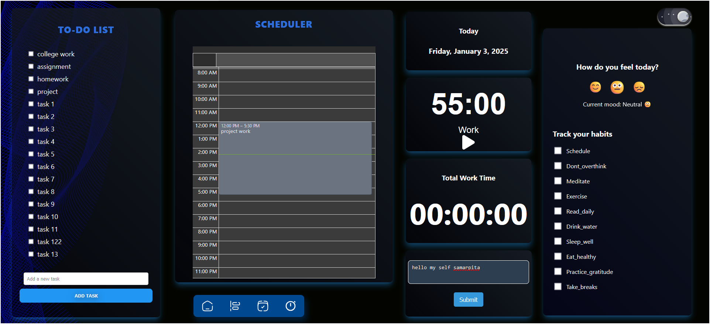
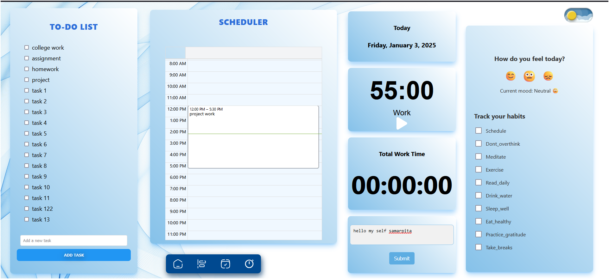

# Pomodoro Todo List Scheduler, Mood & Habit Tracker

site link : https://zeniiith.netlify.app/
**open in 80% zoom ( the site is not responsive)**

A productivity and wellness app built with React that helps users manage tasks using the Pomodoro Technique, track their daily moods, and maintain good habits. This app provides a simple and effective way to stay organized, focused, and motivated.

## Features

- **Pomodoro Timer**: Uses the Pomodoro Technique to help users break their work into intervals (typically 25 minutes of focused work followed by a 5-minute break).
- **Todo List**: Track your daily tasks and mark them as complete when finished.
- **Mood Tracker**: Record and track your mood each day to identify trends and improve your mental wellness.
- **Habit Tracker**: Set daily goals for healthy habits and track your progress over time.
- **Dark Mode**: A clean, user-friendly interface with a dark mode option to make it easier on the eyes during late-night usage.

## Technologies Used

- **React**: JavaScript library for building user interfaces.
- **Styled Components**: For component-level styling in React.
- **Local Storage**: Save tasks, mood, and habit progress between sessions.
- **React Hooks**: Manage state and side effects within functional components.

## Installation

To run this project locally, follow these steps:

1. **Clone the repository**:

   ```bash
   git clone https://github.com/yourusername/pomodoro-todo-mood-habit-tracker.git
   ```

2. **Navigate into the project directory**:

   ```bash
   cd pomodoro-todo-mood-habit-tracker
   ```

3. **Install dependencies**:

   ```bash
   npm install
   ```

4. **Run the app**:

   ```bash
   npm start
   ```

   The app will be available at `http://localhost:3000/`.

## Usage

1. **Pomodoro Timer**:
   - Set a task and start the timer.
   - Work for 25 minutes, followed by a 5-minute break.
   - After 4 cycles, take a longer break (15-30 minutes).

2. **Todo List**:
   - Add tasks to your to-do list.
   - Mark tasks as complete by clicking the checkbox.
   - Delete tasks by clicking the trash icon.

3. **Mood Tracker**:
   - Select your mood for the day from a list of options.
   - Track your mood over time to analyze trends.

4. **Habit Tracker**:
   - Set up habits you want to track (e.g., drinking water, exercising).
   - Mark each habit as complete each day.
   - View your progress over time.

## Screenshots


*Pomodoro timer interface for time management.*
*Track your tasks and mark them as completed.*
*Track your mood and see how you're feeling over time.*




